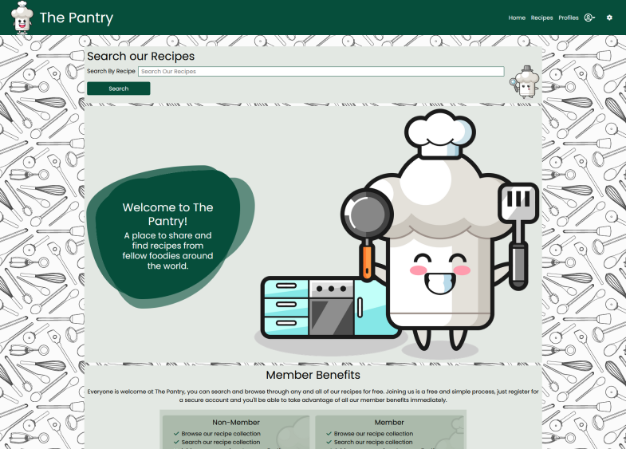

# The Pantry

## Introduction
The Pantry is a website built in Django using Python, JavaScript, CSS and HTML. It enables users to create and share recipes with other users from around the world. It is targetted towards users who enjoy their food and would like to share their recipes with others. Users have the ability to create recipes, and their own profile. They can upload images for use on their recipe or on their profile, link their personal youtube accounts and websites, and like and favorite other users recipes.

This is the fourth project for the Code Institute Diploma in Software Development with eCommerce.

The site provides role based permissions for users to interact with a central dataset. It includes user authentication, email validation, and Full CRUD functionality for Recipes, Ingredients, Steps and User Profiles.

[View the live website on Heroku](https://pp4-the-pantry.herokuapp.com/)

Please note: To open any links in this document in a new browser tab, please press CTRL + Click.

## Table of Contents
* [User Experience Design (UX)](#UX)
    * [The Strategy Plane](#The-Strategy-Plane)
        * [Site Goals](#Site-Goals)
        * [Epics](#Epics)
        * [User Stories](#User-Stories)
    * [The Scope Plane](#The-Scope-Plane)
    * [The Structure Plane](#The-Structure-Plane)
        * [Opportunities](#Opportunities)
    * [The Skeleton Plane](#The-Skeleton-Plane)
        * [Wireframes](#Wireframe-mockups)
        * [Database Schema](#Database-Schema)
    * [The Surface Plane](#The-Surface-Plane)
* [Features](#features)
* [Future Enhancements](#future-enhancements)
* [Technologies Used](#technologies-used)
* [Testing](#testing)
* [Deployment](#deployment)
* [Credits](#credits)

## UX
### The Strategy Plane
*  The Pantry is intended to be a friendly community site for users to create and share their own recipes with others. Users will also be able to find recipes created by other users from around the world. The graphical elements and overall design of the site provide the user with a fun and enjoyable environment.

##### The Sites Ideal User
* Food lover looking to share their favourite recipes with others
* Someone looking to expand their recipe knowledge
* Someone looking for inspiration for new things to try
* Someone looking build their cooking social media following

#### Site Goals

* To provide users with a place to find recipes
* To provide users with a place to share their own recipes
* To provide users with a place to discover new meals

#### Epics

10 Epics were created which were then further developed into 38 User Stories. The details on each epic, along with the user stories linked to each one can be found in the project kanban board [here](https://github.com/MattBCoding/pp4-the-pantry/projects/1)

1. Initial Django setup [#1](https://github.com/MattBCoding/pp4-the-pantry/issues/1)
2. User Profile [#2](https://github.com/MattBCoding/pp4-the-pantry/issues/2)
3. User sign in or sign out [#3](https://github.com/MattBCoding/pp4-the-pantry/issues/3)]
4. User recipes [#4](https://github.com/MattBCoding/pp4-the-pantry/issues/4)]
5. Recipe management [#5](https://github.com/MattBCoding/pp4-the-pantry/issues/5)] 
6. Recipe searching [#6](https://github.com/MattBCoding/pp4-the-pantry/issues/6)
7. recipe viewing [#7](https://github.com/MattBCoding/pp4-the-pantry/issues/7)
8. recipe interaction [#8](https://github.com/MattBCoding/pp4-the-pantry/issues/8)
9. site owner objectives [#9](https://github.com/MattBCoding/pp4-the-pantry/issues/9)
10. recipe rating system [#28](https://github.com/MattBCoding/pp4-the-pantry/issues/28)

### User Stories

From the Epics, 38 User stories were developed. Each story was assigned a classification of Must-Have, Should-Have, Could-Have or Won't Have. Each story was also assigned user story points, based on my best estimation for the time/difficulty of completing each story. A combination of being new to story estimation, inexperience with Django and time constraints during development left me completing 61 story points from the initial total of 131. From the initial 131 points, 82 were for Could Have stories. A number of these stories were created based on an ideal scenario of building out the project whilst I knew in the time available it would be unlikely I would complete those stories. I will however revisit them at a later time for a redevelopment of the project. The full list of User Stories, seperated by those completed and those pushed to a future release is available on the project [kanban board](https://github.com/MattBCoding/pp4-the-pantry/projects/1).

These are the user stories that were completed within the projects first release, by Epic.

1. Initial Django setup
	* US#10 - Django Setup - As a Developer, I want to setup Django and install the supporting libraries predicted to be needed, so that I am ready to start development
	* US#11 - Django secure the secret key's - As a Developer, I want to set up the Django environment to secure the secret keys, so that I do not expose the keys in an insecure way
	* US#12 - Early Deployment to Heroku - As a Developer, I want to deploy the app to heroku, so that I can confirm everything works before development of the site and to enable continuous testing within the production environment
	
2. User Profile
	* US#13 - Create a User Account - As a User, I would like to be able to create an account, so that I can create and save recipes
	* US#14 - Users can view their profile - As a User, I would like to be able to see the details in my user profile, so that I can see what information other users can see about me
	* US#15 - Users can edit their profile - As a User, I would like to be able to edit my profile, so that I can keep the information upto date
	* US#16 - Users can delete their account - As a User, I can delete my account, so that I can remove my details and recipes at my request
	* US#17 - Users can change their password - As a user, I would like to be able to change my password, so that I can keep my account secure
	* US#18 - Users can reset their password - As a User, I would like to be able to reset my password, so that if I forget it I can still access my account

3. User sign in or sign out
	* US#19 - User Account Login / Logout - As a User, I would like to be able to login or logout of my account, so that I can keep my account secure
	* US#20 - Features restricted to signed in users - As a Site Owner, I would like to restrict some features of the site to registered users, so that it encourages people to sign up to the site

4. User recipes
	* US#22 - Create a Recipe - As a User, I would like to be able to share my own recipes, with family and friends so they can teach them to their own children and have fun experiences together baking
	* US#23 - View Recipes - As a User, I can access the recipes on the site, so that I can follow them at home
	* US#24 - Update a recipe - As a user, I can update a recipe that I have created, so that I can correct any mistakes I may have made
	* US#25 - Delete a recipe - As a user, I can delete a recipe that I have created, so that I can remove it from the site

5. Recipe management
	* US#26 - Save other people's recipes to my profile - As a User, I would like to be able to save new recipes, so that I can refer back to them easily at a later date.
	* US#27 - Create a list of Favourite Recipes - As a User, I would like to be able to save my favourite recipes, so that I can find them quickly at a later date

6. Recipe searching
	* US#33 - Recipe Searching - As a User, I would like to be able to find recipes, so that I can increase the variety of meals we consume.
	* US#34 - Recipe Search - Advanced - As a User, I would like to be able to search the recipes, so that I can find the ones that match my fancy at that point in time

7. Recipe viewing
	* US#39 - Clear Recipe Layout - As a User, I would like clear instructions on how to make each recipe, so that I am able to follow along as an inexperienced cook
	* US#36 - Recipe Summary Cards - As a User, I would like to be able to view multiple recipes at the same time, so that I can easily decide which one I want to follow

8. Recipe interaction

9. Site owner objectives
	* US#47 - Responsive Templates - As a Site Owner, I would like my site to be fully responsive, so that Users accessing the site from different devices have an enjoyable experience
	* US#48 - Colour Scheme Preference options - As a Site Owner, I would like the site to havea dark colour option, so that users have the ability to view the site in a colour scheme they prefer.

10. Recipe rating system
	* US#29 - Rate a Recipe - As a User, I can give a recipe a rating, so that I can provide the author feedback and rank recipes that I like

### The Scope Plane

**Features planned:**
* User Profile - Create, Read, Update and Delete
* Recipes - Users can create, read, update and delete their own recipes
* Other Users Recipes - Users can read, like, save other users recipes
* Profiles - Users can read other users profiles
* Users can login to their account, change their password or their email
* Users can reset their password if they forget it
* Users can logout of their account
* Users need to be registered and logged in to access recipe creation, like, save functionality and access other users profiles.
* Responsive Design - the site needs to be fully responsive to cover the wide variety of devices users may use to access a recipe site
* Alternative colour modes available

### The Structure Plane

User Story:

> US#13 - Create a User Account - As a User, I would like to be able to create an account, so that I can create and save recipes

Acceptance Criteria:
* Given that I am an unregistered user, When I am on the homepage, Then I can see a button to sign up, And, When I click on the button, Then I am taken to the user registration page
* Given that I am an unregistered user, And, I am on the user registration page, When I enter my username, email address and password, And, I click on the register button, Then The system creates me an account, And, signs me in.
* Given that I have an account, And, I am signed into the account, When I have an option to create a recipe, And, when I click on that option, Then I am taken to a page where I can provide the details of my recipe
* Given that I am a registered user, When I am signed into my account, Then I do not see the register button

Implementation:
* Clearly accessible call to action on homepage to register for an account
* Clearly accessible link to login or register within main navigation bar
* Easy to use User registration process
* Clear UX design, prevent unnecessary links to register as a user, if user is already logged in.

User Story:

> US#14 - Users can view their profile - As a User, I would like to be able to see the details in my user profile, so that I can see what information other users can see about me

Acceptance Criteria:
* Given that I am logged into my user account
When I can access an option to view my profile
Then my profile details are displayed as they appear to other users

Implementation:
* Prevent information appearing on user's profile that other users can not see such as account information
* If information is required to be displayed that other users can not see, clearly label that information so users are aware that others can not see it.
* Provide clear guidance on how users can control the display of their information on their profile.

User Story:

> US#15 - Users can edit their profile - As a User, I would like to be able to edit my profile, so that I can keep the information upto date

Acceptance Criteria:
* Given that I am logged into my account
When I am viewing my profile
Then I should be able to edit the details
* Given that I am logged into my account
When I click on the edit button on my profile page
Then I should be taken to a page to edit the details
* Given that I am not logged into my account
When I view my profile page, or anyone elses
Then I should not be able to see the edit button
* Given that I am not logged into my account
When I type in the address to edit my profile, or anyone elses
Then I should be redirected to the log in page.

Implementation:
* Provide a clearly accessible button on a user's profile for the profile owner only, so they can edit their profile
* Provide a simple and clear edit profile form, linked from the edit profile button

User Story:

> US#16 - Users can delete their account - As a User, I can delete my account, so that I can remove my details and recipes at my request 

Acceptance Criteria:
* Given that I am a registered user
When I navigate to my account
Then I have an option to delete my account
* Given that I am a registered user viewing my account details
When I click on the option to delete my account
Then I am requested to confirm the request
* Given that I am a registered user viewing my account details
When I click on the option to delete my account
And, When I confirm the request
Then My account and the recipes that I have created are deleted
* Given that I am a registered user
When I delete my account
Then I should receive confirmation of the account deletion

Implementation:
* Provide users with an easily accessible option to delete their account
* Provide users with a secure confirmation process to confirm account deletion requests to prevent accidents
* Link all user created elements so that when a user deletes their account, all associated records are deleted.
* Provide the user with confirmation that their account and associated records have been deleted when requested.

User Story:

> US#17 - Users can change their password - As a user, I would like to be able to change my password, so that I can keep my account secure

Acceptance Criteria:
* Given that I am a registered User, logged in to my account
When I navigate to the edit profile page
Then I have the option to change my password
* Given that I am logged in to my account
When I change my password
Then I receive an email confirming my password has been changed
* Given that I am logged into my account
When I try to change my password
Then I am prevented from creating a password that does not meet security requirements
* Given that I am logged into my account
When I click the change password link
Then I am taken to the change password form
And When I correctly complete the form
And, press submit
Then My password is changed to the new value
And, I receive confirmation on the screen of the change.

Implementation:
* Provide a clear accessible button for users to access the change password functionality
* Provide confirmation to the user that password change requests have been successfull or unsuccessfull
* Provide clear error messages if the user attempts to change their password to something unsuitable

User Story:

> US#18 - Users can reset their password - As a User, I would like to be able to reset my password, so that if I forget it I can still access my account

Acceptance Criteria:
* Given that I am a forgetful user
When I try to login with an incorrect password
Then An option is available to reset my password
* Given that I click on the link to reset my password
When I enter my email address that I used to sign up,
Then I should receive an email with instructions on how to reset my password
* Given that I have received the email to reset my password
When I follow the instructions
Then my password should be reset, or I should be able to set a new password of my choosing
And When I do not follow the instructions,
Then my password should not be reset

Implementation:
* Provide users with the ability to reset their password if they forget it
* Provide users with the ability to reset their password via email - will require email validation

User Story:

> US#19 - User Account Login / Logout - As a User, I would like to be able to login or logout of my account, so that I can keep my account secure

Acceptance Criteria:
* Given that I am a registered user, who is not logged in
When I navigate to the sign in page
And, I enter my credentials correctly and press sign in
Then I am signed into my account
* Given that I am a registered user, who is currently logged in
When I click on the sign out link
Then I am signed out of my account
* Given that I am a registered user, who has signed out of my account
When I use the browser navigation buttons such as back button
Then I can not access information which requires me to be signed in

Implementation:
* Provide login and logout functionality
* Secure restricted pages from access when a user is not signed in.

User Story:

> US#20 - Features restricted to signed in users - As a Site Owner, I would like to restrict some features of the site to registered users, so that it encourages people to sign up to the site

Acceptance Criteria:
* Given that a user is not registered or signed in,
When they view a recipe,
Then they are unable to save a recipe
* Given that a user is not registered or signed in,
When they look at the recipe options
Then they do not have the ability to create a recipe
* Given that a user is not registered or signed in,
When they look at a recipe
Then they are unable to provide a rating or comment
* Given that a user is not registered or signed in,
When they encounter functionality that requires them to be signed in
Then they are presented with a login or register button.

Implementation:
* Restrict the ability to save a recipe to authenticated users
* Restrict the ability to create a recipe to authenticated users
* Restrict the ability to like a recipe to authenticated users
* Redirect users who make a request for functionality that requires them to be authenticated users to the login page

User Story:

> US#22 - Create a Recipe - As a User, I would like to be able to share my own recipes, with family and friends so they can teach them to their own children and have fun experiences together baking

Acceptance Criteria:
* Given that I am a logged in user
When I navigate to the recipe section
Then I have the option to create a recipe
* Given that I have created a recipe as a logged in user
When I save the completed recipe
Then it is available to other users to view

Implementation:
* Provide authenticated users with a clear option to create a recipe
* Make saved recipes available to other users to view

User Story:

> US#23 - View Recipes - As a User, I can access the recipes on the site, so that I can follow them at home

Acceptance Criteria:
* Given that I am a user on the site
When I navigate to the recipes page
Then I am presented with a list of the recipes available
* Given that I am a user on the site
When I navigate to the recipes page
And When I click on a recipe
Then I am presented with the full recipe details

Implementation:
* Provide users of the site with the ability to access all completed recipes
* Provide users of the site with the ability to access the full recipe details from the recipe summary card

User Story:

>  US#24 - Update a recipe - As a user, I can update a recipe that I have created, so that I can correct any mistakes I may have made

Acceptance Criteria:
* Given that I am a registered user who has created a recipe
When I navigate to that recipe
Then I have the option to edit the details
* Given that I am a registered user
When I navigate to someone else's recipe
Then I do not get the edit option
* Given that I am a registered user who has created a recipe
When I navigate to that recipe, and click the option to edit the details
Then I am able to edit the details of the recipe
* Given that I am a registered user who has created a recipe
When I navigate to the recipe, click the option to edit the details
And When I have edited the details of the recipe
Then I have the option to save the changes

Implementation:
* Provide easy access to recipe owners to edit recipes.
* Prevent other users from editing a recipe they did not create
* Provide a method for recipe owners to edit the recipe details - form
* Ensure recipe edits are saved to the database and users are informed of changes

User Story:

> US#25 - Delete a recipe - As a user, I can delete a recipe that I have created, so that I can remove it from the site

Acceptance Criteria:
* Given that I am a registered user who is logged in, and has created a recipe
When I navigate to the recipe that I would like to delete
Then I have the option to delete the recipe
* Given that I am a registered user who is logged in, has created a recipe and I am viewing the recipe I wish to delete
When I click the delete recipe button
Then I receive a confirmation window to confirm that I really want to delete the recipe
* Given that I am a registered user who is logged in, has created a recipe, navigated to that recipe and clicked on the delete recipe button
When the confirmation window appears and I confirm the deletion
Then the recipe is deleted from the system
* Given that I am a registered user, or a non registered user
When I navigate to a recipe page that I did not create
Then I do not have the option to delete the recipe

Implementation:
* Provide recipe owners with the option to delete their recipe
* Provide recipe deletion requests with a confirmation window to prevent mistakes
* Ensure confirmed deletion requests are processed on the database correctly.
* Prevent unauthorised access to recipe deletion functionality

User Story:

> US#26 - Save other people's recipes to my profile - As a User, I would like to be able to save new recipes, so that I can refer back to them easily at a later date.

Acceptance Criteria:
* Given that I am a signed in user
When I find a recipe I would like to keep
Then I can save it to my own profile
* Given that I am not a signed in user
When I find a recipe I would like to save
Then when I click on save, it reminds me to login
And When I login successfully
Then the recipe I originally wanted to save is saved
* Given that I am an unregistered user
When I find a recipe I would like to save
Then when I click on save, it takes me to the login/register page
And When I successfully register an account
Then the recipe I originally wanted to save is saved

Implementation:
* Provide authenticated users with the ability to save other users recipes to their profile
* Provide a redirect to the login page if a user attempts an action that requires them to be logged in
* Unlikely to be achieved - may require user finding the recipe again.

User Story:

> US#27 - Create a list of Favourite Recipes - As a User, I would like to be able to save my favourite recipes, so that I can find them quickly at a later date

Acceptance Criteria:
* Given that I am a signed in user
When I want to look at my saved recipes
Then it should be clear where to find them
* Given that I am a signed in user
When I am looking at recipes I have previously saved
Then I should be able to mark my favourites
* Given that I am a signed in user
When I look at a list of all my saved recipes
Then I should be able to see which are my favourites
* Given that I am a signed in user
When I want to look at only my favourite recipes
Then I should be able to filter my saved recipes to show only the favourites

Implementation:
* Provide authenticated users with easy access to saved recipes
* Provide authenticated users with easy method to both save recipes and mark their favourites
* Provide authenticated users with a visual indicator on recipe summary card if they have saved it or marked it as a favourite
* Provide authenticated users with an easy way to access their favourite recipes

User Story:

> US#33 - Recipe Searching - As a User, I would like to be able to find recipes, so that I can increase the variety of meals we consume.

Acceptance Criteria:
* Given that I am a user of the website
When I navigate to the homepage
Then I can access a link to all the recipes
* Given that I am a user of the website
When I enter the recipe section of the site
Then I have options to navigate to different recipe sections
* Given that I am a user of the website
When I want to view a specific recipe
Then I can access the full recipe details by clicking on the recipe

Implementation:
* Provide ease of access to full recipe list
* Provide users with ability to filter recipes - search functionality
* Provide users with the ability to access full recipe details from the summary card

User Story:

> US#34 - Recipe Search - Advanced - As a User, I would like to be able to search the recipes, so that I can find the ones that match my fancy at that point in time

Acceptance Criteria:
* Given that I am a user of the website
When I navigate to the site
Then I can access a search function to access related recipes
* Given that I am a user of the website
When I search the recipes
Then the search results show relevant recipes

Implementation:
* Provide all users the ability to search the recipes
* Enable search query to match with recipe title and recipe author

User Story:

> US#39 - Clear Recipe Layout - As a User, I would like clear instructions on how to make each recipe, so that I am able to follow along as an inexperienced cook

Acceptance Criteria:
* Given that I am a user
When I click on a recipe to view the details
Then The instructions on how to make the recipe are clearly accessible
* Given that I am a user accessing the recipe details
When I access a recipe instructions
Then They should be easily to identify the order in which they should be followed

Implementation:
* Provide users with a clean and simple recipe detail page layout
* Provide users with a easy to follow instruction list 

User Story:

> US#36 - Recipe Summary Cards - As a User, I would like to be able to view multiple recipes at the same time, so that I can easily decide which one I want to follow

Acceptance Criteria:
* Given that I am a user
When I search for or navigate to the full list of recipes
Then The recipes are summarised individually
* Given that I am a user and I have chosen which of the displayed recipes I'd like to select
When I click on the recipe
Then I am taken to the full recipe details

Implementation:
* Provide users with recipe summary cards
* Link recipe summary cards to full recipe details

User Story:

> US#47 - Responsive Templates - As a Site Owner, I would like my site to be fully responsive, so that Users accessing the site from different devices have an enjoyable experience

Acceptance Criteria:
* Given that I am a user accessing the site on my smartphone
When I navigate through the site
Then all pages should be formatted to my device
* Given that I am a user accessing the site on my tablet
When I navigate through the site
Then all pages should be formatted to my device
* Given that I am a user accessing the site on my laptop
When I navigate through the site
Then all pages should be formatted to my device screen
* Given that I am a user accessing the site on my desktop computer
When I navigate the site
Then all pages should be formatted to suit my screen size

Implementation:
* Provide users with a fully responsive site that responds to mobile, tablet, laptop and desktop sized devices

User Story:

> US#48 - Colour Scheme Preference options - As a Site Owner, I would like the site to havea dark colour option, so that users have the ability to view the site in a colour scheme they prefer.

Acceptance Criteria:
* Given that users visit the site on different devices
When their device has a preferred-colour-scheme set
Then the site should be presented in that scheme
* Given that users visit the site
When they manually set the colour scheme choice
Then the site should remember their preference
* Given that users register for the site
When they log in to the site,
Then the site should change to their personal colour preference without setting a new preference on that device

Implementation:
* Provide users with the choice of colour scheme
* Provide users with a site that recognises their system colour scheme preference

User Story:

> US#29 - Rate a Recipe - As a User, I can give a recipe a rating, so that I can provide the author feedback and rank recipes that I like

Acceptance Criteria:
* Given that I am a logged in User
When I navigate to a recipe detail page
Then I have the ability to provide a rating
* Given that I am a logged in User
When I navigate to a recipe detail page for a recipe I have previously given a rating
Then I can not provide an additional rating
* Given that I am a logged in user
When I navigate to one of the recipes that I created
Then I can not provide a rating
* Given that I am a user that is not logged in
When I navigate to a recipe detail page
Then I do not have the ability to provide a rating

Implementation:
* Provide authenticated users with the ability to rate a recipe
* Restrict authenticated users from rating a recipe multiple times
* Prevent users from rating a recipe they created
* Prevent unauthenticated users from rating a recipe.

#### Opportunities

Arising from user stories
| Opportunities | Importance | Viability / Feasibility
| ------ | :------: | :------: |
| ** Provide users the ability to create an account ** | 5 | 5 |
| ** Provide users the ability to create recipes ** | 5 | 5 |
| ** Provide users the ability to edit recipes ** | 5 | 5 |
| ** Provide users the ability to view recipes ** | 5 | 5 |
| ** Provide users the ability to delete recipes ** | 5 | 5 |
| ** Provide users the ability to edit their account ** | 5 | 5 |
| ** Provide users the ability to view other accounts ** | 5 | 5 |
| ** Provide users the ability to delete their account ** | 5 | 5 |
| ** Provide users the ability to change the colour scheme ** | 2 | 5 |
| ** Provide users the ability to save a recipe ** | 3 | 5 |
| ** Provide users the ability to rate a recipe ** | 3 | 5 |
| ** Provide users the ability to access the site on any device ** | 5 | 5 |
| ** Provide users the ability to search the site for recipes ** | 4 | 5 |

### The Skeleton Plane
#### Wireframe mock-ups

Home page: The home page provides the user with a clear understanding as to the purpose of the site. There is a clear call to action for the user to search for a recipe with the inclusion of a search bar at the top of the home page. The welcome message is clearly visable to the user when they first arrive at the site regardless of the device they are using.

Users have the ability to create recipes to share with other users. The emphasis of the design is to provide a clear recipe layout that can adapt to any size device. Clearly seperating general information, ingredients and steps.

Users also have the ability to create a personal profile. From this profile users can access the recipes they have created and those that they have liked quickly and easily. They can also control the information they share with other users.

Users will have the ability to search for recipes based on a search query of their choice. To aid in the discovery of different recipes, each recipe will be displayed in the form of a summary card from which the user can access the full recipe details.

Users will have the ability to search for other users, so if there is a user who's recipes they like regularly, they can access their profile to find out more information about them.

Wireframes were also produced for each major page for both mobile and tablet devices. With the intention of the site being fully responsive so that no matter the device size the user is viewing the site on, it will display accordingly.

* [Home page mobile wireframe](/assets/wireframes/homepage-mobile.png)
* [Home page tablet wireframe](/assets/wireframes/homepage-tablet.png)
* [Recipe detail page mobile wireframe](/assets/wireframes/recipe-detail-mobile.png)
* [Recipe search page mobile wireframe](/assets/wireframes/recipe-search-mobile.png)
* [Recipe search page tablet wireframe](/assets/wireframes/recipe-search-tablet.png)
* [User profile search results page mobile wireframe](/assets/wireframes/profiles-page-mobile.png)
* [User profile search results page tablet wireframe](/assets/wireframes/profiles-page-tablet.png)

#### Database Schema

Several custom models were predicted to be required when building the site. The intention to utilise AllAuth for the user authentication system, which utilises the built in Django User Model removed the need to build a custom User model, however a custom User Profile was required. In order for the users to create Recipes a custom recipe model was required, which would be linked to the User Profile through using the profile as a foreign key. As each recipe could have a different number of ingredients or steps to it, it was decided to seperate out the ingredients and steps into their own model, and link them to the recipe through a foreign key. The database schema was planned using [DrawSQL app](https://drawsql.app/). Limitations of the app prevented labelling the field types correctly, it did not include the option to override the types available and did not include textarea, cloudinary fields or url fields. The models in the app reflect the true field choice.

### The Surface Plane

#### Design

Once I was happy with the overall structure of the site, and the layout of the wireframes, I selected the colour scheme using the adobe colour selector. This was repeated for the darker colour scheme, I also referenced the google material design guidelines for the darker colour scheme. Both colour schemes were checked for colour contrast to ensure that the appropriate colours were used for a high level of colour contrast to maximise accessibility for users.

##### Typography 
Poppins a sans serif font was chosen for its clean clear design. It is important that the text of the recipes and the site are clear and easy for users to read, especially considering the nature of the site and that users might be reading the recipes whilst cooking.

##### Images
Several cartoon chef characters were accessed from [Vecteezy.com](https://www.vecteezy.com/members/heriyusuf/uploads). The artist Heriyusuf is responsible for the artwork for each cartoon chef. The artwork is available on a free license from [Vecteezy.com](https://www.vecteezy.com). 

## Features
#### Home page
A welcoming homepage was built to welcome the user to the site and clearly convey the sites purpose. The call to action for the user to search for recipes is at the top of the main page, with a large, hero like welcome message appearing just below. At the bottom of the page a clear comparison showing users the benefits of signing up to the site is displayed.

#### Navigation Bar
The main navigation bar appears at the top of the page, clearly displaying the main navigational links users would require.

A secondary user menu is available to users who are logged into the site, users who are not logged in receive a login/register link in its place

The navigation bar and the user menu are fully responsive, adapting to narrower devices by appearing from the right hand side of the screen when the menu button is pressed.

#### Colour Mode Settings
Users have the ability to change the colour scheme in use on the site through a settings menu which opens a modal containing a toggle switch.

#### Footer
A common footer is utilised through out the site to encourage users to visit the social media sites of the main site. They currently direct users to the generic social media sites, all external links open in a new tab.

#### Recipe Search
Users have the ability to search the database of recipes against the recipe title and the author of the recipes username.

#### Recipe Cards
Search results appear in the form of recipe summary cards. The cards show the user the title of the recipe, the featured image of the recipe, and the author of the recipe, if they have chosen to create a username. If the author has included a link to the recipe on Youtube, a little video icon displays. If the User has liked the recipe previously, and they are logged in when conducting the search, a little red thumbs up appears. If the user is logged in and they have added the recipe to their favourites list, a red heart appears on the recipe card. This allows the users to quickly identify the recipes they would like to look at in more detail.

##### Standard Recipe Card

##### Liked Recipe Card with video

##### Favourited Recipe Card

#### User Profile
Users have the ability to create a profile. If they choose not to complete the profile, the area they choose not to complete lets the user know what would appear in that section, it also informs them if other users can see the message or not. The user profile page provides the profile owner with quick access to edit and delete functionality.

Users can also access their own recipes, and the recipes they have liked from their profile page quickly and easily.

#### Edit Profile Page
Users have the ability to edit their profiles on the site. The edit profile page is clearly laid out, and informs the user of the characters remaining for each field. The current profile image is displayed with the user having the ability to change the image.

#### Create/Edit Recipe Page
Users have the ability to create and edit their recipes. The create recipe and edit recipe page is clearly laid out, with the ingredients and steps sectioned off and individually editable/deletable.

##### Recipe Form

##### Ingredients Form

##### Steps Form

#### Access to Edit Recipe and Delete Recipe Functionality
Only the users that create the recipe can edit it or delete it. If the authorised user is the recipe author, then the edit recipe and delete recipe buttons will appear on the recipe detail page. The recipe like counter appears on the recipe card for recipes the user created, however it is not functional, and only displays the total number of likes that recipe has received.

##### Own recipe detail card

##### Other users recipe detail card

## Future Enhancements
There are several items of functionality that I would like to add in the future. I have left the original user stories that were developed in the project kanban board as future enhancement opportunities.
The key areas I would like to add to the site in the future are:
* The ability for users to message other users
* The ability for users to comment on recipes
* The ability for users to login via social networks such as google or facebook

Some of the functionality above is provided by allauth which is already installed into the site, and therefore only has to be setup in order for it to function. Others would need to be developed completely.

## Testing

### Testing Strategy
I utilised a manual testing strategy for the development of the site. A full detailed breakdown of the testing procedures and methodology can be found in the testing.md file [here](TESTING.md).
Seperate to the functionality testing of the site, and the testing of the code, User Story tests were implemented to ensure that the acceptance criteria of the user stories listed above were met. The commit at which the functionality requirements for each user story were met is listed in the issues section of the repo. It was applied to each issue before it was closed and marked as completed.

#### Testing Overview

Testing was divided into different sections to ensure everything was tested individually with test cases developed for each area.

[Testing Schedule Overview](/assets/testing/test-schedule.pdf)

A full detailed breakdown of the testing procedures and methodology can be found in the testing.md file [here](TESTING.md)

#### Validator Testing
All code files were validated using suitable validators for the specific language. The full details can be found in the testing.md file.
All code passed the validation, with only code generated by other parties producing errors or warnings.
* Django built in code within the settings file produced five line length errors. 
* Bootstrap code produced 260 warnings in the CSS validation. 
* Fontawesome cdn produced 6 HTML validation errors relating to css variables within the cdn css code. 
* The HTMX library that is inserted into the HTML template by django produces a warning stating that the link does not need to have the javascript file type declared.

#### Notable Bugs

The use of CloudinaryFields for the images in the recipe and profile models does not enforce input validation to image file types. I could also not find anything related to enforcing the file types within the cloudinary documentation. This enabled users to attempt to upload non-image file types. To combat this issue, within the view that handles the form submission, I utilised a try, except statement that attempts to upload the file, but if the upload fails due to the file type error on the cloudinary servers, it gracefully handles the error and provides the user with an error message informing them what happened and why. This prevents users from breaking the functionality of the site, whilst still enabling them to correct the file they are trying to upload.

Development bugs: One major bug encountered during development still has me puzzled. I would repeatedly be unable to access the deployed site through Google Chrome on my home computer. Other users and I could access the deployed site on Google Chrome on other computers without issue, or in other browsers on the developement computer, however something on the computer used for development of the site would cause an issue repeatedly in chrome. This created a number of issues during the development of the site that had to be overcome.

No other bugs of note were found during development of the site. Several minor bugs were encountered due to small logic mistakes or scenario's unaccounted for, however these were found during the several rounds of testing and corrected. There are no known bugs left in the site.

#### Technologies Used

* Python
    * The following python modules were used on this project:
        * asgiref==3.5.0
        * certifi==2021.10.8
        * cffi==1.15.0
        * charset-normalizer==2.0.12
        * cloudinary==1.29.0
        * cryptography==36.0.1
        * defusedxml==0.7.1
        * dj-database-url==0.5.0
        * dj3-cloudinary-storage==0.0.6
        * Django==3.2
        * django-allauth==0.48.0
        * django-htmx==1.9.0
        * gunicorn==20.1.0
        * idna==3.3
        * oauthlib==3.2.0
        * psycopg2==2.9.3
        * pycparser==2.21
        * PyJWT==2.3.0
        * python3-openid==3.2.0
        * pytz==2021.3
        * requests==2.27.1
        * requests-oauthlib==1.3.1
        * six==1.16.0
        * sqlparse==0.4.2
        * urllib3==1.26.8

* Django
    * Django was used as the main python framework in the development of this project
    * Django AllAuth was utilised to provide enhanced user account management functionality.
* Heroku
    * Was used as the cloud based platform to deploy the site on
* Heroku PostgreSQL
    * Heroku PostgreSQL was used as the database for this project during development and in production.
* HTMX
    * HTMX is a JavaScript library that enables forms to be submitted and data to be retrieved from the backend without refreshing the entire page. It was used extensively for pages that included form submission such as the creation of the recipes where creating ingredients in another model, and creating steps in a third model was required. This package provided a simpler approach to using multiple formsets and custom JavaScript.
* JavaScript
    * Custom JavaScript was utilised to enable the colour scheme functionality, the mobile menu, the enabling and disabling of buttons on forms to prevent users inadvertantly causing errors when trying to submit multiple forms at the same time, and to display the current image in the form rather than a hyperlink to the image itself.
* Bootstrap 5.13
    * Bootstrap was used for general layout and spacing requirements for the site.
* Font Awesome
    * Was used for access to several icons for different sections where icons were appropriate.
* CSS
    * Custom css was written for a large number of areas on the site to implement custom styling and escape a bootstrap look and feel to the site.
* Jinja/Django Templating
    * Jinja/Django templating language was utilised to insert data from the database into the sites pages. It was also utilised to perform queries on different datasets.
* HTML
    * HTML was used as the base language for the templates created for the site.

#### Packages Used

* VS Code was used to develop the site
* Git was utilised for version control and transferring files between the code editor and the repository
* GitHub was utilised for storing the files for this project
* Balsamiq was utilised to develop wireframes for the site from which the design was based
* Adobe Illustrator was used to adapt images for use within the site.
* DrawSQL.app was used to develop the database schema during development

#### Resources Used

* The Django documentation was used extensively during development of this project
* The HTMX documentation was used as a reference source for the development of the HTMX features
* The Django AllAuth documentation was used as a reference and a guide for implementing the package and its features.
* The Cloudinary documentation was used extensively during development to setup the configuration between django and the cloudinary apis
* The Code Institute reference material was used as a general reference for things that I had previously done during the course.
* All other resources used are referenced where appropriate.

##### Other Libraries Used

## Deployment

The site was deployed via Heroku, and the live link can be found here - [The Pantry](https://pp4-the-pantry.herokuapp.com/)

### Project Deployment

To deploy the project through Heroku I followed these steps:
* Sign up / Log in to [Heroku](https://www.heroku.com/)
* From the main Heroku Dashboard page select 'New' and then 'Create New App'
* Give the project a name - I entered The-Pantry and select a suitable region, then select create app. The name for the app must be unique.
* This will create the app within Heroku and bring you to the deploy tab. From the submenu at the top, navigate to the resources tab.
* Add the database to the app, in the add-ons section search for 'Heroku Postgres', select the package that appears and add 'Heroku Postgres' as the database
* Navigate to the setting tab, within the config vars section copy the DATABASE_URL to the clipboard for use in the Django configuration.
* Within the django app repository create a new file called env.py - within this file import the os library and set the environment variable for the DATABASE_URL pasting in the address copied from Heroku. The line should appear as os.environ["DATABASE_URL"]= "Paste the link in here"
* Add a secret key to the app using os.environ["SECRET_KEY"] = "your secret key goes here"
* Add the secret key just created to the Heroku Config Vars as SECRET_KEY for the KEY value and the secret key value you created as the VALUE
* In the settings.py file within the django app, import Path from pathlib, import os and import dj_database_url
* insert the line if os.path.isfile("env.py"): import env
* remove the insecure secret key that django has in the settings file by default and replace it with SECRET_KEY = os.environ.get('SECRET_KEY')
* replace the databases section with DATABASES = { 'default': dj_database_url.parse(os.environ.get("DATABASE_URL"))} ensure the correct indentation for python is used.
* In the terminal migrate the models over to the new database connection
* Navigate in a browser to cloudinary, log in, or create an account and log in. 
* From the dashboard - copy the CLOUDINARY_URL to the clipboard
* in the env.py file created earlier - add os.environ["CLOUDINARY_URL"] = "paste in the Url copied to the clipboard here"
* In Heroku, add the CLOUDINARY_URL and value copied to the clipboard to the config vars
* Also add the KEY - DISABLE_COLLECTSTATIC with the Value - 1 to the config vars
* this key value pair must be removed prior to final deployment
* Add the cloudinary libraries to the list of installed apps, the order they are inserted is important, 'cloudinary_storage' goes above 'django.contrib.staitcfiles' and 'cloudinary' goes below it.
* in the Settings.py file - add the STATIC files settings - the url, storage path, directory path, root path, media url and default file storage path.
* Link the file to the templates directory in Heroku TEMPLATES_DIR = os.path.join(BASE_DIR, 'templates')
* Change the templates directory to TEMPLATES_DIR - 'DIRS': [TEMPLATES_DIR]
* Add Heroku to the ALLOWED_HOSTS list the format will be the app name given in Heroku when creating the app followed by .herokuapp.com
* In your code editor, create three new top level folders, media, static, templates
* Create a new file on the top level directory - Procfile
* Within the Procfile add the code - web: guincorn PROJECT_NAME.wsgi
* In the terminal, add the changed files, commit and push to GitHub
* In Heroku, navigate to the deployment tab and deploy the branch manually - watch the build logs for any errors.
* Heroku will now build the app for you. Once it has completed the build process you will see a 'Your App Was Successfully Deployed' message and a link to the app to visit the live site.

#### Forking the repository
By forking the GitHub Repository you can make a copy of the original repository to view or change without it effecting the original repository
This can be done by
    * Log into GitHub or create an account.
    * Locate the repository at https://github.com/MattBCoding/pp4-the-pantry .
    * At the top of the repository, on the right side of the page, select "Fork" from the buttons available.
    * A copy of the repository should now be created in your own repository.

#### Create a clone of this repository
Creating a clone enables you to make a copy of the repository at that point in time - this lets you run a copy of the project locally:
This can be done by:
* Navigate to https://github.com/MattBCoding/pp4-the-pantry
* click on the arrow on the green code button at the top of the list of files
* select the clone by https option and copy the URL it provides to the clipboard
* navigate to your code editor of choice and within the terminal change the directory to the location you want to clone the repository to.
* type 'git clone' and paste the https link you copied from github
* press enter and git will clone the repository to your local machine

### Acknowledgements

I'd like to thank the following:
* Daisy McGirr for all her help during this project.
* Sean and Ed at CI Tutor support for their patience and pointing me in the right direction when I went off course.